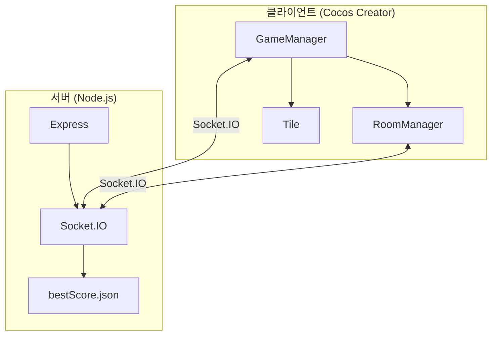
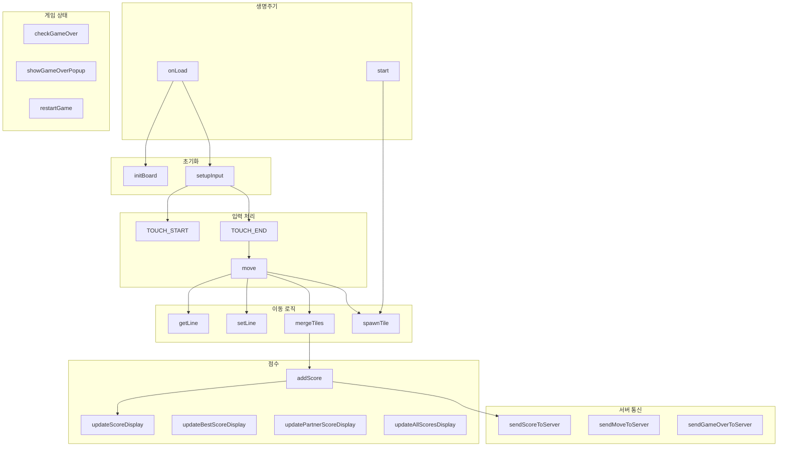
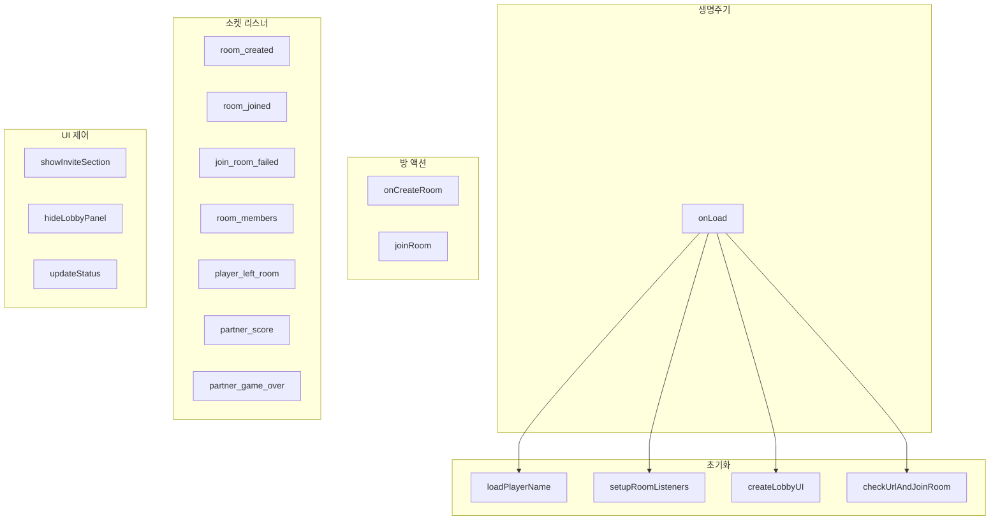
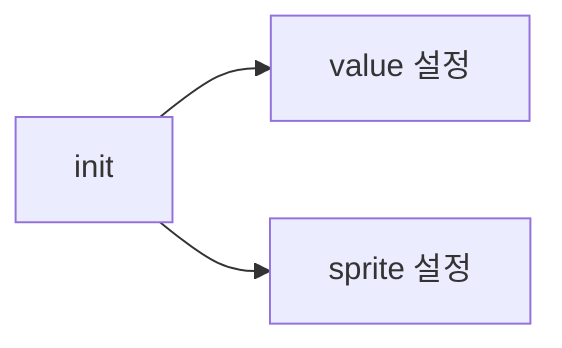
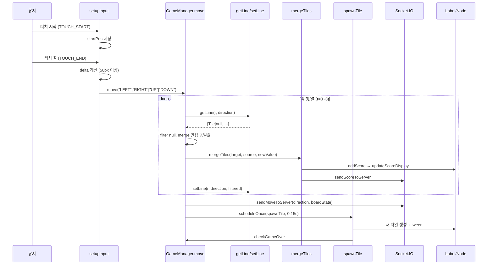
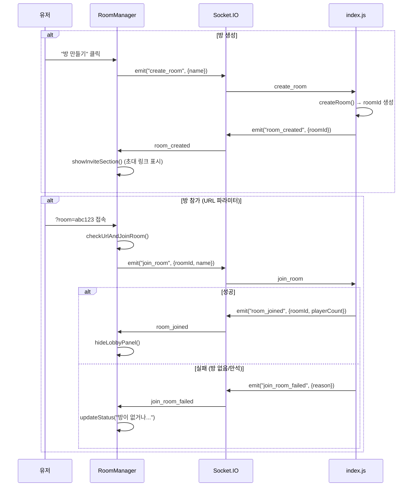
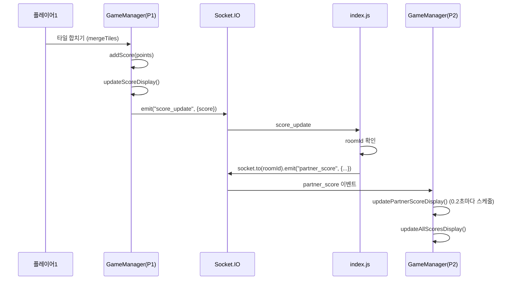
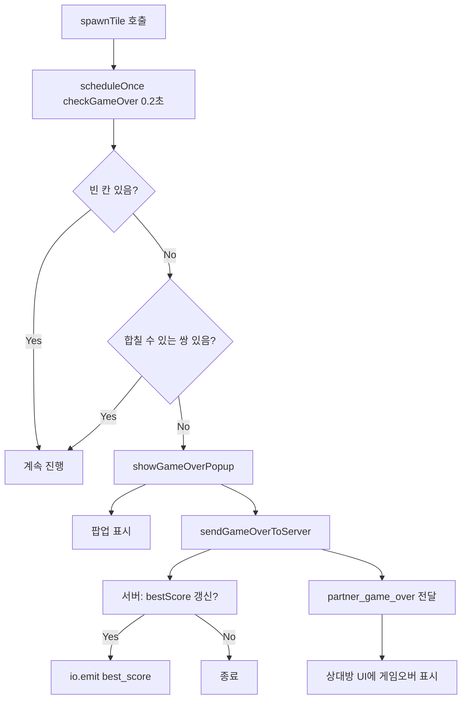
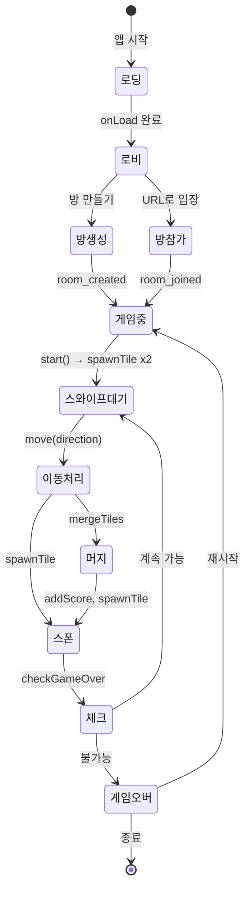

# 2048with 프로젝트 구조 도식화

## 1. 프로젝트 폴더 구조

```
2048with/
├── 2048with_Client/              # Cocos Creator 3.8.8 클라이언트
│   ├── assets/
│   │   ├── Scripts/
│   │   │   ├── GameManager.ts    # 게임 핵심 로직
│   │   │   ├── RoomManager.ts    # 멀티플레이 방 관리
│   │   │   └── Tile.ts           # 타일 컴포넌트
│   │   ├── Scenes/
│   │   │   └── Main.scene
│   │   └── Prefabs/
│   │       └── Tile.prefab
│   └── build/web-mobile/
│
└── 2048with_Server/              # Node.js 서버
    ├── index.js                  # Express + Socket.IO
    ├── bestScore.json            # 최고 점수 저장
    └── web-mobile/               # 정적 빌드 파일 서빙
```

---

## 2. 컴포넌트 의존성 다이어그램



---

## 3. 클래스별 함수 구조

### 3.1 GameManager 함수 맵



### 3.2 RoomManager 함수 맵



### 3.3 Tile 함수 맵



---

## 4. 유저 동작별 입출력 플로우

### 4.1 스와이프 → 타일 이동 (핵심 게임 플로우)



### 4.2 방 생성/참가 플로우



### 4.3 점수 동기화 플로우 (멀티플레이)



### 4.4 게임 오버 플로우



---

## 5. 서버 이벤트 입출력 매트릭스

| 클라이언트 → 서버 | 서버 처리 | 서버 → 클라이언트 |
|------------------|----------|-------------------|
| `create_room` {name} | createRoom(), broadcastRoomMembers | `room_created` {roomId} |
| `join_room` {roomId, name} | joinRoom() | `room_joined` {roomId, playerCount} / `join_room_failed` {reason} |
| `leave_room` | leaveRoom() | `player_left_room` {leftSocketId, playerCount} |
| `score_update` {score} | roomId 확인 | `partner_score` {socketId, score, name} (같은 방에만) |
| `game_over` {score} | bestScore 갱신, saveBestScore | `partner_game_over` {socketId, score, name} / `best_score` (전체) |
| `tile_move` {direction, boardState} | 로깅만 | - |
| (connection) | loadBestScore() | `best_score` {score} |

---

## 6. 전체 게임 라이프사이클



---

## 7. 데이터 흐름 요약

```
[유저 입력]
    │
    ├─ 터치 스와이프 ──→ setupInput ──→ move() ──→ getLine/setLine/mergeTiles
    │                                              │
    │                                              ├─→ addScore ──→ UI 갱신
    │                                              ├─→ sendMoveToServer
    │                                              └─→ spawnTile ──→ checkGameOver
    │
    └─ 방 만들기/참가 ──→ RoomManager ──→ Socket.IO ──→ Server
                                                          │
                                                          └─→ partner_score, room_members 등
```

---

*이 문서는 프로젝트 코드 분석을 바탕으로 자동 생성되었습니다.*
